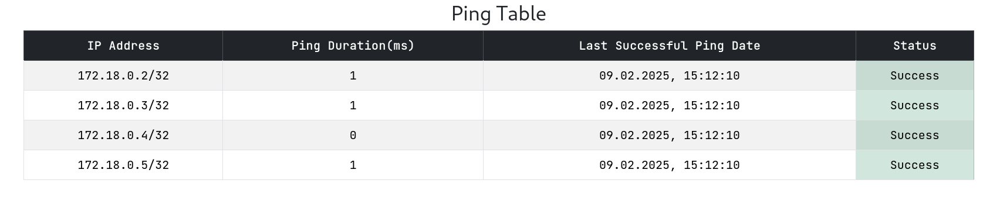

# DockerLens

## Table of Contents
- [About](#-about)
- [Features](#-features)
- [How to Build and Run](#-how-to-build-and-run)

## 🔎 About
**DockerLens** - monitoring tool designed to track running Docker containers by pinging them with defined intervals. It consists of three core services:  

- **RESTful Backend API** – Manages container data and provides endpoints for retrieving information.  
- **Pinger Service** – Continuously monitors Docker containers, tracking their status and IP addresses.  
- **React Frontend** – Provides interface for visualizing container ping information in table format.  

## 📋 Features
### 🚀 Continuous Container Monitoring  
- The pinger service actively tracks Docker container events such as **start** and **stop**, ensuring an up-to-date container list.  
### 📡 Container Pinging  
- Continously pings active containers at configurable intervals to monitor their status.  
### 💾 Data Storage  
- Maintains real-time container IPs and ping data using **in-memory storage** and **PostgreSQL repositories**.  


## 🚀 How to Build and Run
## 🛠 Prerequisites  
Before you begin, make sure you have the following installed:  

- [Docker](https://docs.docker.com/get-docker/)
- [Golang](https://go.dev/dl/) (for backend development)
- [Docker Compose](https://docs.docker.com/compose/install/)  
- [Node.js](https://nodejs.org/) (for frontend development)  

### 📑 Step 1: Clone the Repo
```sh
git clone https://github.com/Mixturka/DockerLens.git
cd DockerLens
```

### 🔀 Step 2: Configure Environment According to .env.example
```sh
cp backend/.env.example backend/.env

cp frontend/.env.example frontend/.env

cp pinger/.env.example pinger/.env

cp database/postgres/.env.example database/postgres/.env
```
> ⚠️ **Warning:** Make sure you add the absolute POSTGRES_MIGRATIONS_PATH in `database/postgres/.env` file before starting the application!

> 📘 **Info:** On windows WSL usage is prefered

### 🐳 Step 3: Build and Start Dockerized Services
```sh
sudo docker compose -f deployments/docker/docker-compose.yml --env-file=database/postgres/.env up
```

### 🌐 Step 4: Use Application
Default setup:
- **Frontend**: `http://localhost:3000`